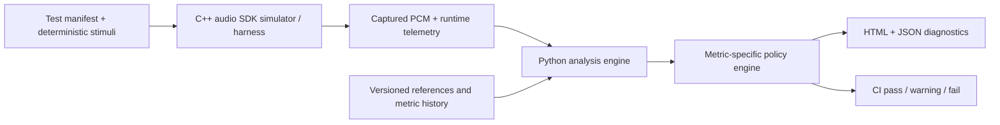

# Audio Validation Systems Lab

An interview-oriented, production-style demonstration of how to turn audio behavior into measurable, repeatable, and actionable engineering evidence.

> [!IMPORTANT]
> This is an independent educational project. It is not affiliated with, endorsed by, or based on proprietary information from Sony Interactive Entertainment or PlayStation.

## Project status

The repository is currently in the **Specification-Driven Development (SDD)** phase. The architecture, observable behavior, acceptance criteria, and planned tests are defined before production code is introduced.

The first implementation milestone will demonstrate an end-to-end audio regression workflow spanning:

- A C++ audio system under test and real-time-style processing harness.
- Python orchestration and signal analysis.
- A `pybind11` boundary between C++ and Python.
- Deterministic fault injection.
- Metric-specific validation policy.
- JSON and HTML developer diagnostics.
- Automated tests and CI gates.

## System overview



The central demonstration compares a known-good baseline with a candidate implementation containing controlled defects. A failure must explain not only that behavior changed, but also:

- What changed.
- Where it changed.
- By how much.
- Which requirement was violated.
- Which artifacts support the diagnosis.
- How another engineer can reproduce it.

## Planned demonstration

The reference scenario will run a deterministic signal through two versions of a simulated audio component. Fault injection will support cases such as:

- Integer and fractional delay.
- Gain and polarity changes.
- Swapped channels and crosstalk.
- Clicks, dropouts, repeated blocks, and clipping.
- DC offset and non-finite samples.
- Clock drift.
- Floating-point perturbations.
- Filter or resampler regressions.

The resulting report will preserve latency as its own metric before aligning signals for residual analysis. It will include metric values, thresholds, waveform and spectral evidence, the exact failure region, environment provenance, and a reproduction command.

## Engineering principles

1. **Observable contracts before implementation.** Every feature starts as a reviewed specification with stable requirement IDs.
2. **Determinism by default.** Seeds, stimuli, configurations, assets, and environment metadata are explicit and versioned.
3. **Alignment must not hide regressions.** Delay, gain, polarity, or drift compensation is never implicit. Each permitted transform is declared in the test manifest and its raw value remains reportable.
4. **Metric-specific policy.** Bit-exactness, numerical tolerance, spectral similarity, latency, and statistical trends solve different problems and use different gates.
5. **Test the validator.** Synthetic labeled faults verify that each detector catches its target defect without misclassifying legitimate signals.
6. **Real-time safety is a contract.** The simulated callback has bounded work, preallocated memory, explicit overflow behavior, and no blocking operations.
7. **Diagnostics are part of the product.** A pass/fail bit without evidence is not considered a complete result.
8. **Reproducibility over infrastructure theater.** The first milestone is locally runnable and CI-friendly; distributed storage and hardware orchestration remain documented extensions.

## Planned repository structure

```text
.
|-- CMakeLists.txt                 # Future top-level native build
|-- CMakePresets.json              # Future reproducible build presets
|-- configs/                       # Versioned validation manifests and policies
|-- cpp/
|   |-- include/avsys/             # Public native contracts
|   |-- src/                       # C++ implementation
|   |-- bindings/                  # pybind11 module boundary
|   `-- tests/                     # GTest unit, stress, and conformance tests
|-- python/
|   `-- avsys/                     # Orchestration, analysis, policy, and reporting
|-- tests/
|   |-- python/                    # PyTest tests
|   |-- integration/               # Cross-language pipeline tests
|   `-- vectors/                   # Small deterministic test vectors
|-- schemas/                       # Versioned manifest and result schemas
|-- docs/
|   |-- sdd/                       # SDD lifecycle and specification template
|   |-- specs/                     # System and feature specifications
|   `-- adr/                       # Architecture Decision Records
`-- third_party/
    `-- pybind11/                  # Git submodule pinned to v3.1.0
```

Directories labeled "Future" are part of the approved design but are intentionally not scaffolded until their owning specification enters implementation.

## Validation layers

| Layer | Purpose | Typical execution |
|---|---|---|
| Native unit | DSP primitives, SPSC invariants, numeric behavior | Every change |
| Python unit | Metrics, policies, manifests, and reporting | Every change |
| Cross-language integration | Python -> pybind11 -> C++ -> Python contracts | Every change |
| Offline conformance | Filters, resampling, channel routing, regression comparison | Pull request |
| Stress and sanitizers | Concurrency, wraparound, long-running stream behavior | Pull request/nightly |
| Statistical trend | Repeated performance measurements and drift detection | Nightly/release |
| Spatial conformance | HRTF/HRIR feature extraction and trajectory continuity | Nightly/release |
| Hardware-in-the-loop | Optional future end-to-end capture | Release/manual lab |

## C++ and Python boundary

Python owns orchestration, configuration, offline analysis, policy evaluation, and reporting. C++ owns bounded block processing, the simulated runtime, native DSP components, the SPSC transport, and performance-sensitive primitives.

`pybind11` exposes coarse-grained operations rather than per-sample calls. Planned bindings pass NumPy-compatible buffers with explicit shape, dtype, channel layout, mutability, and ownership contracts. See [ADR-0002](docs/adr/ADR-0002-pybind11-boundary.md).

## pybind11 submodule

The repository pins `pybind11` to tag `v3.1.0` at commit `97bf890db679505a14dfe547a5e77bb2bd05dc90`.

Clone with submodules:

```bash
git clone --recurse-submodules https://github.com/maxiaortiz22/playstation-audio-swe.git
```

Initialize an existing clone:

```bash
git submodule update --init --recursive
```

Verify the pinned revision:

```bash
git submodule status
git -C third_party/pybind11 describe --tags --exact-match
```

Submodule upgrades require a dedicated Architecture Decision Record or an amendment to ADR-0002, followed by native and Python compatibility tests.

## Specification-Driven Development workflow


No production feature is considered complete until:

1. Its specification is accepted.
2. All `SHALL` requirements map to automated tests or an explicitly documented manual verification.
3. The implementation passes those tests.
4. Generated diagnostics have been reviewed for usefulness.
5. The specification status is updated to `Verified`.

The full lifecycle and change rules are documented in [docs/sdd/README.md](docs/sdd/README.md).

## Specification index

- [SPEC-000: System and product contract](docs/specs/SPEC-000-system-contract.md)
- [SPEC-001: Aligned audio regression comparator](docs/specs/SPEC-001-regression-comparator.md)
- [SPEC-002: Real-time harness and SPSC transport](docs/specs/SPEC-002-realtime-spsc.md)
- [SPEC-003: Filter and resampler conformance](docs/specs/SPEC-003-filter-resampler.md)
- [SPEC-004: Diagnostics, policy, and CI](docs/specs/SPEC-004-diagnostics-ci.md)
- [SPEC-005: Spatial/HRTF conformance](docs/specs/SPEC-005-spatial-hrtf.md)
- [SPEC-006: Statistical regression detection](docs/specs/SPEC-006-statistical-regression.md)

## Architecture decisions

- [ADR-0001: Use SDD and traceable requirement IDs](docs/adr/ADR-0001-specification-driven-development.md)
- [ADR-0002: Use pybind11 as a pinned Git submodule](docs/adr/ADR-0002-pybind11-boundary.md)
- [ADR-0003: Use metric-specific policies instead of one global threshold](docs/adr/ADR-0003-metric-specific-policy.md)

## Current milestone exit criteria

The specification milestone is complete when:

- All links in this README resolve.
- Every planned subsystem has a specification with testable requirements.
- Cross-spec dependencies and exclusions are explicit.
- pybind11 is pinned and reproducibly initialized.
- No production behavior is implied solely by undocumented assumptions.

Implementation will begin only after the initial specifications are reviewed and any open decisions required for Milestone 1 are resolved.
