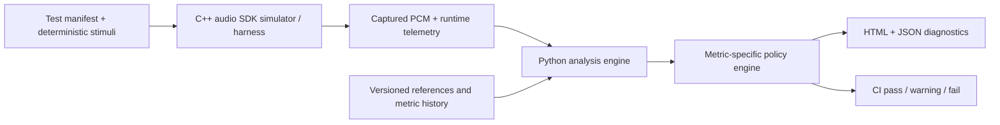

# Audio Validation Systems Lab

An interview-oriented, production-style demonstration of how to turn audio behavior into measurable, repeatable, and actionable engineering evidence.

> [!IMPORTANT]
> This is an independent educational project. It is not affiliated with, endorsed by, or based on proprietary information from Sony Interactive Entertainment or PlayStation.

## Project status

The repository is in the first implementation phase of its
**Specification-Driven Development (SDD)** lifecycle. The 2026-08-15
[Milestone 1 contract acceptance review](docs/sdd/M1-acceptance-review.md)
accepted the system, real-time transport, and diagnostics contracts. The
comparator contract is now `Accepted` after its explicit M1 alignment-policy
decision; the combined filter/resampler specification remains in `Review`
until its recorded evidence/governance gates close. The M1 foundation slice
provides reproducible native build/test, wheel/import, and strict JSON-schema
validation without introducing DSP behavior.

The first implementation milestone will demonstrate an end-to-end audio regression workflow spanning:

- A C++ audio system under test and real-time-style processing harness.
- Python orchestration and signal analysis.
- A `pybind11` boundary between C++ and Python.
- Deterministic fault injection.
- Metric-specific validation policy.
- JSON and HTML developer diagnostics.
- Automated tests and CI gates.

## System overview



The central demonstration compares a known-good baseline with a candidate implementation containing controlled defects. A failure must explain not only that behavior changed, but also:

- What changed.
- Where it changed.
- By how much.
- Which requirement was violated.
- Which artifacts support the diagnosis.
- How another engineer can reproduce it.

## Planned demonstration

The reference scenario will run a deterministic signal through two versions of a simulated audio component. Fault injection will support cases such as:

- Integer delay in M1; fractional-delay fault characterization and estimator
  selection are post-M1 scope.
- Gain and polarity changes.
- Swapped channels and crosstalk.
- Clicks, dropouts, repeated blocks, and clipping.
- DC offset and non-finite samples.
- Clock drift.
- Floating-point perturbations.
- Filter regressions in M1; general resampler conformance in M2.

The resulting report will preserve latency as its own metric before aligning signals for residual analysis. It will include metric values, thresholds, waveform and spectral evidence, the exact failure region, environment provenance, and a reproduction command.

## Engineering principles

1. **Observable contracts before implementation.** Every feature starts as a reviewed specification with stable requirement IDs.
2. **Determinism by default.** Seeds, stimuli, configurations, assets, and environment metadata are explicit and versioned.
3. **Alignment must not hide regressions.** Delay, gain, polarity, or drift compensation is never implicit. Each permitted transform is declared in the test manifest and its raw value remains reportable.
4. **Metric-specific policy.** Bit-exactness, numerical tolerance, spectral similarity, latency, and statistical trends solve different problems and use different gates.
5. **Test the validator.** Synthetic labeled faults verify that each detector catches its target defect without misclassifying legitimate signals.
6. **Real-time safety is a contract.** The simulated callback has bounded work, preallocated memory, explicit overflow behavior, and no blocking operations.
7. **Diagnostics are part of the product.** A pass/fail bit without evidence is not considered a complete result.
8. **Reproducibility over infrastructure theater.** The first milestone is locally runnable and CI-friendly; distributed storage and hardware orchestration remain documented extensions.

## Planned repository structure

```text
.
|-- AGENTS.md                     # Repository-wide SDD and engineering instructions
|-- CMakeLists.txt                 # Reproducible C++20 native/binding build
|-- CMakePresets.json              # Native and sanitizer build presets
|-- configs/                       # Versioned validation manifests and policies
|-- cpp/
|   |-- include/avsys/             # Public native contracts
|   |-- src/                       # C++ implementation
|   |-- bindings/                  # pybind11 module boundary
|   `-- tests/                     # GTest unit, stress, and conformance tests
|-- python/
|   `-- avsys/                     # Orchestration, analysis, policy, and reporting
|-- tests/
|   |-- python/                    # PyTest tests
|   |-- integration/               # Cross-language pipeline tests
|   `-- vectors/                   # Small deterministic test vectors
|-- schemas/                       # Versioned manifest and result schemas
|-- docs/
|   |-- sdd/                       # SDD lifecycle and specification template
|   |-- specs/                     # System and feature specifications
|   `-- adr/                       # Architecture Decision Records
`-- third_party/
    |-- googletest/                # Git submodule pinned to v1.17.0
    `-- pybind11/                  # Git submodule pinned to v3.1.0
```

Only the metadata-only native component, packaging boundary, and initial JSON
contracts are implemented. The remaining directories describe approved future
structure and are not production behavior until their owning specification
enters implementation.

## Foundation quick start

The versioned toolchain record is
[`toolchain/m1-v1.json`](toolchain/m1-v1.json). Use CMake 3.31.6, Ninja 1.12.1,
a supported C++ compiler, and CPython 3.11-3.13. On Windows, run native and
wheel commands from an x64 Visual Studio 2022 v143 developer environment.

Initialize and verify both pinned submodules:

```bash
git submodule update --init --recursive
python tools/verify_submodules.py
```

Configure from a fresh CMake cache, build, and run the native test:

```powershell
where.exe cl.exe
ninja --version
cmake --fresh --preset native-debug -DCMAKE_CXX_COMPILER=cl.exe
cmake --build --preset native-debug
ctest --preset native-debug
```

On Linux, set `CC=gcc-13 CXX=g++-13` or
`CC=clang-18 CXX=clang++-18` for the intended ADR-0006 row before the same
preset commands.

Create a local Python environment and install the reviewed hash lock. PowerShell
activation is shown; use `.venv/bin/activate` on POSIX:

```powershell
python -m venv .venv
.venv\Scripts\Activate.ps1
python -m pip install --require-hashes -r requirements/build-test.lock
$env:PYTHONPATH = "python"
python -m pytest tests/python
Remove-Item Env:PYTHONPATH
```

Build without PEP 517 isolation so the reviewed build lock remains
authoritative:

```powershell
$env:CMAKE_ARGS = "-DCMAKE_CXX_COMPILER=cl.exe"
python -m build --wheel --no-isolation
Remove-Item Env:CMAKE_ARGS
```

Install the wheel and its runtime lock in a second clean environment, then run
the import from outside the source tree:

```powershell
$repo = (Get-Location).Path
python -m venv build/smoke-venv
build/smoke-venv/Scripts/python.exe -m pip install --require-hashes -r requirements/runtime.lock
$wheel = (Get-ChildItem -LiteralPath dist -Filter *.whl).FullName
build/smoke-venv/Scripts/python.exe -m pip install --no-deps $wheel
Push-Location $env:TEMP
& "$repo/build/smoke-venv/Scripts/python.exe" -c "import avsys; assert avsys.native_version() == avsys.__version__"
Pop-Location
```

On POSIX, the equivalent clean install/import is:

```bash
python -m venv build/smoke-venv
build/smoke-venv/bin/python -m pip install --require-hashes -r requirements/runtime.lock
build/smoke-venv/bin/python -m pip install --no-deps dist/*.whl
repo="$PWD"
smoke_dir="$(mktemp -d)"
cd "$smoke_dir"
"$repo/build/smoke-venv/bin/python" -c "import avsys; assert avsys.native_version() == avsys.__version__"
```

## Alignment calibration spike

`T-CMP-CAL-001` is an offline, standard-library-only experiment that calibrates
the integer cross-correlation ambiguity contract without adding a production
comparator to `avsys`. Its frozen labels, formulas, bounded OFAT sweep, corpus
separation, and decision rule are documented in
[`docs/calibration/T-CMP-CAL-001-method.md`](docs/calibration/T-CMP-CAL-001-method.md).

Reproduce FASE B with the frozen experiment and explicit M1 decision:

```powershell
python tools/alignment_calibration.py --config configs/calibration/t_cmp_cal_001.json --decision configs/policies/m1-alignment-operating-point.json --output artifacts/t_cmp_cal_001
```

Full per-lag results remain under ignored `artifacts/`. The small reviewed
JSON/CSV/Markdown/SVG evidence is versioned under
`docs/evidence/T-CMP-CAL-001/`. The owner selected `OP-B-intermediate` only for
the M1 manifest/policy; the versioned decision has no automatic selector,
fallback, or universal default. SPEC-001 is `Accepted`, not `Verified`.

Dependency versions, sources, licenses, and purposes are recorded in the
[`dependency inventory`](docs/dependency-inventory.md). The four visible CI
families are native, Python/schema, cross-language wheel/import, and native
ASan/UBSan. Hosted execution evidence remains distinct from local evidence.

## Validation layers

| Layer | Purpose | Typical execution |
|---|---|---|
| Native unit | DSP primitives, SPSC invariants, numeric behavior | Every change |
| Python unit | Metrics, policies, manifests, and reporting | Every change |
| Cross-language integration | Python -> pybind11 -> C++ -> Python contracts | Every change |
| Offline conformance | Filters, resampling, channel routing, regression comparison | Pull request |
| Stress and sanitizers | Concurrency, wraparound, long-running stream behavior | Pull request/nightly |
| Statistical trend | Repeated performance measurements and drift detection | Nightly/release |
| Spatial conformance | HRTF/HRIR feature extraction and trajectory continuity | Nightly/release |
| Hardware-in-the-loop | Optional future end-to-end capture | Release/manual lab |

## C++ and Python boundary

Python owns orchestration, configuration, offline analysis, policy evaluation, and reporting. C++ owns bounded block processing, the simulated runtime, native DSP components, the SPSC transport, and performance-sensitive primitives.

`pybind11` exposes coarse-grained operations rather than per-sample calls. Planned bindings pass NumPy-compatible buffers with explicit shape, dtype, channel layout, mutability, and ownership contracts. See [ADR-0002](docs/adr/ADR-0002-pybind11-boundary.md).

## pybind11 submodule

The repository pins `pybind11` to tag `v3.1.0` at commit `97bf890db679505a14dfe547a5e77bb2bd05dc90`.

Clone with submodules:

```bash
git clone --recurse-submodules https://github.com/maxiaortiz22/playstation-audio-swe.git
```

Initialize an existing clone:

```bash
git submodule update --init --recursive
```

Verify the pinned revision:

```bash
git submodule status
git -C third_party/pybind11 describe --tags --exact-match
```

Submodule upgrades require a dedicated Architecture Decision Record or an amendment to ADR-0002, followed by native and Python compatibility tests.

## Specification-Driven Development workflow


No production feature is considered complete until:

1. Its specification is accepted.
2. All `SHALL` requirements map to automated tests or an explicitly documented manual verification.
3. The implementation passes those tests.
4. Generated diagnostics have been reviewed for usefulness.
5. The specification status is updated to `Verified`.

The full lifecycle and change rules are documented in [docs/sdd/README.md](docs/sdd/README.md).

## Specification index

- [SPEC-000: System and product contract](docs/specs/SPEC-000-system-contract.md) — Accepted
- [SPEC-001: Aligned audio regression comparator](docs/specs/SPEC-001-regression-comparator.md) — Accepted
- [SPEC-002: Real-time harness and SPSC transport](docs/specs/SPEC-002-realtime-spsc.md) — Accepted
- [SPEC-003: Filter and resampler conformance](docs/specs/SPEC-003-filter-resampler.md) — Review
- [SPEC-004: Diagnostics, policy, and CI](docs/specs/SPEC-004-diagnostics-ci.md) — Accepted
- [SPEC-005: Spatial/HRTF conformance](docs/specs/SPEC-005-spatial-hrtf.md)
- [SPEC-006: Statistical regression detection](docs/specs/SPEC-006-statistical-regression.md)

## Architecture decisions

- [ADR-0001: Use SDD and traceable requirement IDs](docs/adr/ADR-0001-specification-driven-development.md)
- [ADR-0002: Use pybind11 as a pinned Git submodule](docs/adr/ADR-0002-pybind11-boundary.md)
- [ADR-0003: Use metric-specific policies instead of one global threshold](docs/adr/ADR-0003-metric-specific-policy.md)
- [ADR-0004: Use strict JSON for M1 serialized contracts](docs/adr/ADR-0004-json-contracts.md)
- [ADR-0005: Generate deterministic M1 stimuli at runtime](docs/adr/ADR-0005-generated-stimuli.md)
- [ADR-0006: Bound the M1 toolchain, CI matrix, and dependencies](docs/adr/ADR-0006-m1-toolchain-ci-dependencies.md)
- [ADR-0007: Use inline SPSC payloads and explicit cache-line separation](docs/adr/ADR-0007-spsc-payload-and-alignment.md)

## Current contract status

The initial documentation inventory and acceptance review are complete:

- All links in this README resolve.
- Every planned subsystem has a specification with testable requirements.
- Cross-spec dependencies and exclusions are explicit.
- pybind11 is pinned and reproducibly initialized.
- No production behavior is implied solely by undocumented assumptions.

Implementation may begin only for an `Accepted` specification. The
correlation-ambiguity gate is closed and comparator production work may proceed
under SPEC-001 in a later change. The full M1 end-to-end implementation remains
blocked on the filter calibration and governance work needed to accept
SPEC-003. General resampler conformance is already M2.
The review's decision table, dependency graph, PR roadmap, and remaining human
decisions are in
[docs/sdd/M1-acceptance-review.md](docs/sdd/M1-acceptance-review.md).

Coding agents must also follow the repository-wide workflow and engineering constraints in [AGENTS.md](AGENTS.md).
