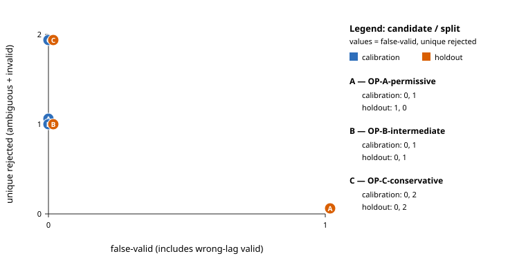

# T-CMP-CAL-001 calibration evidence

- **Phase:** FASE B; explicit human operating-point decision recorded
- **SPEC-001 status:** `Accepted` (not `Verified`)
- **Source revision:** `165450adabaf2ea30d7cb7310d74ea0fae2bc3ed`
- **Dirty at execution:** `false`
- **Configuration SHA-256:** `f065613292b263a4a024d1b724a2be2e7a83d18b622222d560c690517aa25664`
- **Frozen candidate-set SHA-256:** `8c754de0823e06ef9f43cc24e07b168fa8c19ca26c3d19dcf4cbeac7a3e657b2`
- **Frozen corpus-provenance SHA-256:** `d6457d7f14c41a899164089ef8d5fbf0fe254ac4972f4fb4b106ded02bd01ee0`
- **M1 decision SHA-256:** `67b6d1be69196074986da4b20f274d8aec33ab92f65e5a0d672ac0561faaacab`
- **Curated summary SHA-256:** `270e58e8b54a423cf714e6907a1d7e1e11cc4bce694f937999b0a924b2ded27e`
- **Ignored full raw result SHA-256:** `76d162533471fb0b7bbe94caee9e75d5668163a9d5dfe7f1e6610430037938d5`

The labels, formulas, tie/plateau/exclusion rules, error definitions,
sweep bounds, and leakage interpretation were frozen in
[`T-CMP-CAL-001-method.md`](../../calibration/T-CMP-CAL-001-method.md)
before evaluating holdout. No production comparator is included.

## Reproduction

```text
python tools/alignment_calibration.py --config configs/calibration/t_cmp_cal_001.json --decision configs/policies/m1-alignment-operating-point.json --output artifacts/t_cmp_cal_001
```

The command writes full lag observations under ignored `artifacts/`.
The checked-in summary omits those large curves but records their run digest.

## Corpus separation

Calibration cases: 28; holdout cases: 28.
Case IDs, seeds, concrete generator families, canonical parameter digests,
and generated PCM-pair digests have empty calibration/holdout intersections.
See `cases.csv` and `summary.json` for the recorded generator provenance.

## Frozen operating-point candidates

| Candidate | Split | False-valid | Wrong-lag valid | False-ambiguous | False-invalid | Matrix |
|---|---|---:|---:|---:|---:|---|
| OP-A-permissive | calibration | 0 | 0 | 0 | 1 | unique: V=18 A=0 I=1; ambiguous: V=0 A=5 I=0; invalid: V=0 A=0 I=4 |
| OP-A-permissive | holdout | 1 | 1 | 0 | 0 | unique: V=15 A=0 I=0; ambiguous: V=0 A=8 I=0; invalid: V=0 A=0 I=5 |
| OP-B-intermediate | calibration | 0 | 0 | 0 | 1 | unique: V=18 A=0 I=1; ambiguous: V=0 A=5 I=0; invalid: V=0 A=0 I=4 |
| OP-B-intermediate | holdout | 0 | 0 | 0 | 1 | unique: V=14 A=0 I=1; ambiguous: V=0 A=8 I=0; invalid: V=0 A=0 I=5 |
| OP-C-conservative | calibration | 0 | 0 | 0 | 2 | unique: V=17 A=0 I=2; ambiguous: V=0 A=5 I=0; invalid: V=0 A=0 I=4 |
| OP-C-conservative | holdout | 0 | 0 | 0 | 2 | unique: V=13 A=0 I=2; ambiguous: V=0 A=8 I=0; invalid: V=0 A=0 I=5 |

`false_valid` includes ambiguous-as-valid, invalid-as-valid, and wrong-lag
valid outcomes. It is therefore the safety count used by the owner's initial
zero-false-valid holdout criterion.



## Holdout results by family

| Candidate | Family | Cases | False-valid | Wrong-lag | False-ambiguous | False-invalid | Correct ambiguous | Correct invalid |
|---|---|---:|---:|---:|---:|---:|---:|---:|
| OP-A-permissive | harmonic-comb-v1 | 3 | 0 | 0 | 0 | 0 | 3 | 0 |
| OP-A-permissive | integer-chirp-v1 | 4 | 0 | 0 | 0 | 0 | 0 | 0 |
| OP-A-permissive | near-silence-v1 | 3 | 0 | 0 | 0 | 0 | 0 | 3 |
| OP-A-permissive | rademacher-noise-v1 | 11 | 1 | 1 | 0 | 0 | 0 | 0 |
| OP-A-permissive | repeated-block-v1 | 3 | 0 | 0 | 0 | 0 | 3 | 0 |
| OP-A-permissive | short-sync-offset-v1 | 2 | 0 | 0 | 0 | 0 | 0 | 2 |
| OP-A-permissive | tapered-plateau-v1 | 2 | 0 | 0 | 0 | 0 | 2 | 0 |
| OP-B-intermediate | harmonic-comb-v1 | 3 | 0 | 0 | 0 | 0 | 3 | 0 |
| OP-B-intermediate | integer-chirp-v1 | 4 | 0 | 0 | 0 | 0 | 0 | 0 |
| OP-B-intermediate | near-silence-v1 | 3 | 0 | 0 | 0 | 0 | 0 | 3 |
| OP-B-intermediate | rademacher-noise-v1 | 11 | 0 | 0 | 0 | 1 | 0 | 0 |
| OP-B-intermediate | repeated-block-v1 | 3 | 0 | 0 | 0 | 0 | 3 | 0 |
| OP-B-intermediate | short-sync-offset-v1 | 2 | 0 | 0 | 0 | 0 | 0 | 2 |
| OP-B-intermediate | tapered-plateau-v1 | 2 | 0 | 0 | 0 | 0 | 2 | 0 |
| OP-C-conservative | harmonic-comb-v1 | 3 | 0 | 0 | 0 | 0 | 3 | 0 |
| OP-C-conservative | integer-chirp-v1 | 4 | 0 | 0 | 0 | 0 | 0 | 0 |
| OP-C-conservative | near-silence-v1 | 3 | 0 | 0 | 0 | 0 | 0 | 3 |
| OP-C-conservative | rademacher-noise-v1 | 11 | 0 | 0 | 0 | 2 | 0 | 0 |
| OP-C-conservative | repeated-block-v1 | 3 | 0 | 0 | 0 | 0 | 3 | 0 |
| OP-C-conservative | short-sync-offset-v1 | 2 | 0 | 0 | 0 | 0 | 0 | 2 |
| OP-C-conservative | tapered-plateau-v1 | 2 | 0 | 0 | 0 | 0 | 2 | 0 |

## Parameters and tradeoffs

### OP-A-permissive

Preserve more unique low-level/noisy alignments while rejecting exact ties.

- `plateau_epsilon=1e-06` unitless absolute score difference
- `maximum_primary_plateau_width_frames=4` frames
- `secondary_exclusion_radius_frames=2` frames
- `minimum_primary_abs_correlation=0.35` unitless
- `minimum_accepted_peak_ratio=1.05` unitless
- `sync_rms_floor_linear_fs=1e-07` linear FS RMS
- `minimum_overlap_frames=32` frames
- Holdout: false-valid=1, false-ambiguous=0, false-invalid=0.

### OP-B-intermediate

Middle profile for ambiguity rejection and usable low-level evidence.

- `plateau_epsilon=1e-05` unitless absolute score difference
- `maximum_primary_plateau_width_frames=2` frames
- `secondary_exclusion_radius_frames=4` frames
- `minimum_primary_abs_correlation=0.5` unitless
- `minimum_accepted_peak_ratio=1.1` unitless
- `sync_rms_floor_linear_fs=1e-05` linear FS RMS
- `minimum_overlap_frames=64` frames
- Holdout: false-valid=0, false-ambiguous=0, false-invalid=1.

### OP-C-conservative

Reject weak, broad, or moderately competing evidence at higher false-ambiguous risk.

- `plateau_epsilon=0.0001` unitless absolute score difference
- `maximum_primary_plateau_width_frames=1` frames
- `secondary_exclusion_radius_frames=8` frames
- `minimum_primary_abs_correlation=0.7` unitless
- `minimum_accepted_peak_ratio=1.25` unitless
- `sync_rms_floor_linear_fs=0.001` linear FS RMS
- `minimum_overlap_frames=128` frames
- Holdout: false-valid=0, false-ambiguous=0, false-invalid=2.

## Holdout sensitivity strata

| Candidate | Factor | Category | Cases | False-valid | Wrong-lag | False-ambiguous | False-invalid |
|---|---|---|---:|---:|---:|---:|---:|
| OP-A-permissive | polarity | inverted | 2 | 0 | 0 | 0 | 0 |
| OP-A-permissive | polarity | normal | 26 | 1 | 1 | 0 | 0 |
| OP-A-permissive | level | low | 7 | 0 | 0 | 0 | 0 |
| OP-A-permissive | level | near_silence | 3 | 0 | 0 | 0 | 0 |
| OP-A-permissive | level | nominal | 17 | 1 | 1 | 0 | 0 |
| OP-A-permissive | level | very_low | 1 | 0 | 0 | 0 | 0 |
| OP-A-permissive | lag_position | lower_boundary | 2 | 0 | 0 | 0 | 0 |
| OP-A-permissive | lag_position | negative | 3 | 0 | 0 | 0 | 0 |
| OP-A-permissive | lag_position | not_applicable | 13 | 0 | 0 | 0 | 0 |
| OP-A-permissive | lag_position | positive | 7 | 1 | 1 | 0 | 0 |
| OP-A-permissive | lag_position | upper_boundary | 2 | 0 | 0 | 0 | 0 |
| OP-A-permissive | lag_position | zero | 1 | 0 | 0 | 0 | 0 |
| OP-A-permissive | noise | high_snr | 1 | 0 | 0 | 0 | 0 |
| OP-A-permissive | noise | low_snr | 1 | 0 | 0 | 0 | 0 |
| OP-A-permissive | noise | medium_snr | 1 | 0 | 0 | 0 | 0 |
| OP-A-permissive | noise | none | 25 | 1 | 1 | 0 | 0 |
| OP-A-permissive | energy | active | 25 | 1 | 1 | 0 | 0 |
| OP-A-permissive | energy | near_silence | 3 | 0 | 0 | 0 | 0 |
| OP-A-permissive | overlap | normal | 26 | 1 | 1 | 0 | 0 |
| OP-A-permissive | overlap | short | 2 | 0 | 0 | 0 | 0 |
| OP-B-intermediate | polarity | inverted | 2 | 0 | 0 | 0 | 0 |
| OP-B-intermediate | polarity | normal | 26 | 0 | 0 | 0 | 1 |
| OP-B-intermediate | level | low | 7 | 0 | 0 | 0 | 0 |
| OP-B-intermediate | level | near_silence | 3 | 0 | 0 | 0 | 0 |
| OP-B-intermediate | level | nominal | 17 | 0 | 0 | 0 | 1 |
| OP-B-intermediate | level | very_low | 1 | 0 | 0 | 0 | 0 |
| OP-B-intermediate | lag_position | lower_boundary | 2 | 0 | 0 | 0 | 0 |
| OP-B-intermediate | lag_position | negative | 3 | 0 | 0 | 0 | 0 |
| OP-B-intermediate | lag_position | not_applicable | 13 | 0 | 0 | 0 | 0 |
| OP-B-intermediate | lag_position | positive | 7 | 0 | 0 | 0 | 1 |
| OP-B-intermediate | lag_position | upper_boundary | 2 | 0 | 0 | 0 | 0 |
| OP-B-intermediate | lag_position | zero | 1 | 0 | 0 | 0 | 0 |
| OP-B-intermediate | noise | high_snr | 1 | 0 | 0 | 0 | 0 |
| OP-B-intermediate | noise | low_snr | 1 | 0 | 0 | 0 | 0 |
| OP-B-intermediate | noise | medium_snr | 1 | 0 | 0 | 0 | 0 |
| OP-B-intermediate | noise | none | 25 | 0 | 0 | 0 | 1 |
| OP-B-intermediate | energy | active | 25 | 0 | 0 | 0 | 1 |
| OP-B-intermediate | energy | near_silence | 3 | 0 | 0 | 0 | 0 |
| OP-B-intermediate | overlap | normal | 26 | 0 | 0 | 0 | 1 |
| OP-B-intermediate | overlap | short | 2 | 0 | 0 | 0 | 0 |
| OP-C-conservative | polarity | inverted | 2 | 0 | 0 | 0 | 0 |
| OP-C-conservative | polarity | normal | 26 | 0 | 0 | 0 | 2 |
| OP-C-conservative | level | low | 7 | 0 | 0 | 0 | 0 |
| OP-C-conservative | level | near_silence | 3 | 0 | 0 | 0 | 0 |
| OP-C-conservative | level | nominal | 17 | 0 | 0 | 0 | 1 |
| OP-C-conservative | level | very_low | 1 | 0 | 0 | 0 | 1 |
| OP-C-conservative | lag_position | lower_boundary | 2 | 0 | 0 | 0 | 0 |
| OP-C-conservative | lag_position | negative | 3 | 0 | 0 | 0 | 1 |
| OP-C-conservative | lag_position | not_applicable | 13 | 0 | 0 | 0 | 0 |
| OP-C-conservative | lag_position | positive | 7 | 0 | 0 | 0 | 1 |
| OP-C-conservative | lag_position | upper_boundary | 2 | 0 | 0 | 0 | 0 |
| OP-C-conservative | lag_position | zero | 1 | 0 | 0 | 0 | 0 |
| OP-C-conservative | noise | high_snr | 1 | 0 | 0 | 0 | 0 |
| OP-C-conservative | noise | low_snr | 1 | 0 | 0 | 0 | 0 |
| OP-C-conservative | noise | medium_snr | 1 | 0 | 0 | 0 | 0 |
| OP-C-conservative | noise | none | 25 | 0 | 0 | 0 | 2 |
| OP-C-conservative | energy | active | 25 | 0 | 0 | 0 | 2 |
| OP-C-conservative | energy | near_silence | 3 | 0 | 0 | 0 | 0 |
| OP-C-conservative | overlap | normal | 26 | 0 | 0 | 0 | 2 |
| OP-C-conservative | overlap | short | 2 | 0 | 0 | 0 | 0 |

## Sensitivity and limitations

`summary.json` records candidate sensitivity strata for polarity, level, lag
position/boundary, noise, energy, overlap, sync origins, and duration. Positive
gain and polarity should not change `abs(rho)` except through sign or RMS-floor
crossings; the evidence tests those invariants rather than claiming sensitivity
where the normalized metric has none.

This deterministic corpus demonstrates known-case coverage; it does not estimate
a population error rate. OFAT does not cover all parameter interactions, variants
from one construction are correlated, and reusing this holdout after changing a
candidate would turn it into tuning data. Large per-lag score observations remain
outside source control.

## Accepted M1 operating point

The repository owner explicitly selected **OP-B-intermediate**.
This decision applies only to the M1 manifest/policy; it is not a universal default.
There is no automatic selection and no fallback operating point.

- `plateau_epsilon=1e-05` unitless absolute score difference
- `maximum_primary_plateau_width_frames=2` frames
- `secondary_exclusion_radius_frames=4` frames
- `minimum_primary_abs_correlation=0.5` unitless
- `minimum_accepted_peak_ratio=1.1` unitless
- `sync_rms_floor_linear_fs=1e-05` linear FS RMS
- `minimum_overlap_frames=64` frames

The rerun satisfies the approved deterministic holdout budget: false-valid=0, wrong-lag valid=0, false-ambiguous=0, false-invalid=1.

The accepted false-invalid is `holdout-rademacher-noise-v1-10`: its 48-frame sync region cannot satisfy the selected 64-frame minimum overlap, so the result remains `invalid` with reason `no_lag_passed_energy_and_overlap`.

The rationale is recorded in the M1 decision policy and in SPEC-001. The spike does
not include a production comparator, and acceptance does not claim verification.
