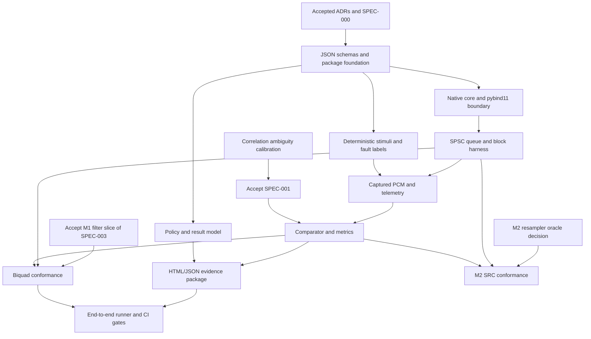

# Milestone 1 contract acceptance review

- **Review date:** 2026-08-15
- **Scope:** SPEC-000 through SPEC-004
- **Implementation produced:** None
- **Branch:** `codex/m1-contract-acceptance`

## Outcome

This review accepts the stable system, real-time transport, and diagnostics
contracts while preserving two honest blockers. Production work may begin only
against specifications marked `Accepted`; the complete M1 end-to-end runner is
blocked until SPEC-001 and the M1 slice of SPEC-003 are accepted.

| Specification | Disposition | Reason |
|---|---|---|
| SPEC-000 | Accepted | Format, stimulus, toolchain, dependency, and M1 tier decisions are closed. |
| SPEC-001 | Review | Exact correlation/overlap semantics are proposed, but the ambiguity operating point still needs calibration and owner approval. |
| SPEC-002 | Accepted | Inline capture, telemetry, overflow, alignment fallback, TSan platform, and test mapping are closed. |
| SPEC-003 | Review | The M1 biquad equations are proposed, but its tail-bound/numerical-envelope spike and combined-spec governance remain open; resampler work is explicitly M2. |
| SPEC-004 | Accepted | JSON policy, dual status, Jinja2/static reporting, warnings, artifacts, and CI behavior are closed. |

No status is `Verified`: the repository contains no production implementation,
build entry point, schema, test runner, or CI workflow yet.

## Decision record

| Topic | Alternatives reviewed | Decision | Justification and evidence gate |
|---|---|---|---|
| Manifest and policy format | JSON; YAML; both | Strict JSON only in M1 | One parser and schema system; exact-byte digest. See ADR-0004. |
| Stimulus provenance | Runtime generation; committed WAV; both | Versioned runtime generation | Parameters and labeled faults remain auditable; diagnostic WAV is generated output. See ADR-0005. |
| Compiler/platform/Python matrix | One host; full cross product; bounded matrix | Windows/MSVC and Linux/GCC+Clang; Python 3.11-3.13 | Covers ABI and compiler diversity without matrix theater. CI evidence is still pending. See ADR-0006. |
| Fractional delay | Parabolic interpolation; phase/GCC; defer | Integer-only M1 policy; fractional estimation deferred | Avoids claiming unvalidated sub-frame precision. A comparative estimator spike is M2 work. |
| Spectral aggregation | Linear fixed bands; octave bands; arbitrary bands | Explicit arbitrary `[low_hz, high_hz)` bands | Manifest-owned bands fit test intent; aggregate linear power before dB and retain per-channel/band evidence. |
| Correlation ambiguity | Universal ratio; per-test guess; calibrated operating point | Calibrated per stimulus class, no default | SPEC-001 remains Review until the deterministic calibration/holdout experiment and human risk selection complete. |
| Drift execution tier | Every PR end-to-end; extended only; split | Fast algebra/validity unit cases plus extended long sweep | Preserves fast deterministic feedback without inventing a universal runtime or ppm tolerance. |
| SPSC capture/telemetry | Combined packet; pool indices; separate inline queues | Separate typed inline queues | Simpler ownership; audio and telemetry loss remain distinguishable. Benchmark before any pool redesign. See ADR-0007. |
| False-sharing fallback | Standard constant only; unconditional 64; validated fallback | Standard value when valid, 64 bytes for M1 x86_64 fallback, explicit override otherwise | Avoids a silent architecture-wide claim and records the selected layout value. |
| ThreadSanitizer | Windows; Linux GCC; Linux Clang | Ubuntu 24.04 x86_64 with Clang 18 | Clang documents Linux x86_64 support; job is native-only and never supplies timing policy. |
| Filter and resampler scope | FIR; biquad; both; full SRC | Stateful DF2T low-pass biquad in M1; SRC requirements in M2 | Biquad exercises state/reset/chunking with a float64 analytical oracle. General resampling would add an unchosen oracle and dependency. |
| HTML generation | String templates; Jinja2; Plotly/client JS | Jinja2 autoescape plus Matplotlib static assets | Offline, inspectable reports without CDN/JavaScript; semantic and link tests avoid cross-platform pixel assumptions. |
| Warnings and artifacts | Warnings gate releases; always nonzero; policy promotion | Warnings exit 0 in all M1 tiers; use explicit `fail` severity for a gate | Avoids context-dependent status promotion. JSON+HTML upload on every run; context audio/plots on fail/invalid; upload uses `always()`. |
| Dependencies | Standard library only; broad DSP/report stack; minimal reviewed set | pybind11, NumPy, SciPy, jsonschema, Jinja2, Matplotlib plus build/test-only tools | Each dependency has a specific boundary; versions, transitives, license, and lock hashes are implementation-PR gates. See ADR-0006. |

## Local toolchain audit

The local machine provides Windows 11 x64, Visual Studio Community 2022
17.14.7, MSVC 19.44 through the developer environment, Windows SDK
10.0.26100.0, CMake 3.31.6, Visual Studio Ninja 1.12.1, Anaconda CPython
3.12.7, Git 2.50.0, and GitHub CLI 2.96.0. A Strawberry MinGW GCC 13.2 is on
the ordinary PATH but is not a supported Windows binding toolchain.

The exact pybind11 submodule tag and commit are `v3.1.0` and
`97bf890db679505a14dfe547a5e77bb2bd05dc90`. No Linux/Clang/TSan or alternate
Python version was available locally. The future CI matrix in ADR-0006 must
produce that evidence before the corresponding support claims can be verified.

## Dependency inventory

| Dependency | Scope | License family | Required purpose | Introduction gate |
|---|---|---|---|---|
| pybind11 3.1.0 | Build/binding | BSD-3-Clause | Coarse C++/Python buffer boundary | Already pinned; keep ADR-0002 upgrade checks |
| NumPy | Runtime | BSD-3-Clause | Float32 buffers and array primitives | Oldest/newest supported ABI test and locked wheels |
| SciPy | Runtime | BSD-3-Clause | Correlation, Welch/spectral helpers, analytical utilities | Matrix wheel spike and method-version provenance |
| jsonschema | Runtime | MIT | JSON Schema Draft 2020-12 validation | Negative schema/path diagnostics |
| Jinja2 | Runtime/report | BSD-3-Clause | Escaped maintainable HTML templates | Autoescape and malicious-text test |
| Matplotlib | Runtime/report | PSF-compatible | Static diagnostic plots | Agg backend, fixed style metadata, semantic report tests |
| scikit-build-core, build, wheel | Build/packaging | Apache-2.0/MIT | PEP 517 native-extension packages | Fresh locked wheel build/import |
| pytest | Test only | MIT | Python and integration tests | Pin with development constraints |
| GoogleTest | Test only | BSD-3-Clause | Native unit/stress tests | Pin revision and avoid execution-time network access |

The lock files, SBOM/license inventory, and exact versions belong to the PR
that first introduces packaging. The global Anaconda environment is evidence
of local availability, not a dependency lock.

## Implementation dependency graph

## Roadmap of small pull requests

Ranges below are shorthand for explicit requirement-ID lists in test metadata;
machine-readable traceability must enumerate every ID rather than store ranges.

| PR | Vertical outcome | Requirements implemented and verified | Depends on |
|---:|---|---|---|
| 1 | Calibration spike and accepted integer-alignment contract; no production feature | Contract evidence for `SYS-TTV-004`, `CMP-ALIGN-001..008` | This review |
| 2 | Fresh configure, native test, wheel build/import, and schema round-trip | `SYS-BND-001`, `SYS-REP-003`, `SYS-EXE-006..007`, `RPT-SCHEMA-001..009`, `CI-RUN-006` | PR 1 may run in parallel |
| 3 | JSON manifest to deterministic generated PCM with immutable baseline inputs | `SYS-REP-001`, `SYS-REP-003..005`, `SYS-EXE-001`, `POL-BASE-001..005`, `RPT-REP-003..004`, `CI-RUN-009` | PR 2 |
| 4 | Native float32 passthrough callable once from Python | `SYS-BND-002..005`, `SYS-EXE-002..004`, `RT-PY-001..003` | PR 2, PR 3 |
| 5 | Functional SPSC with wraparound and memory-order evidence | `RT-SPSC-001..006`, `RT-MEM-001..006`, `RT-QUE-001..007` | PR 2 |
| 6 | Callback harness with independent capture/telemetry overflow | `RT-CB-001..007`, `RT-OVR-001..005`, `RT-BLK-001..005`, `RT-PY-004` | PR 4, PR 5 |
| 7 | Timing provenance plus short PR and long sanitizer/stress tiers | `RT-TIME-001..007`, `CI-RUN-003`, `CI-RUN-006..007` | PR 6 |
| 8 | Structural validation, integer lag, declared overlap, and compensation record | `SYS-EXE-005`, `SYS-ANL-001..002`, `SYS-ANL-005`, `CMP-STR-001..005`, `CMP-ALIGN-001..008`, `CMP-COMP-001..005` | PR 1, PR 3 |
| 9 | Residual, spectral, gain, and channel metrics | `CMP-MET-001..009`, `CMP-CH-001..004` | PR 8 |
| 10 | Labeled event detectors with positive/negative/boundary cases | `CMP-EVT-001..006`, `SYS-TTV-001..004`, `SYS-DIAG-002` | PR 8, PR 9 |
| 11 | Diagnostic drift estimator with extended sensitivity sweep | `CMP-DRIFT-001..003`, `CMP-COMP-004` | PR 8 |
| 12 | Metric-specific policy engine with immutable validation outcome | `SYS-ANL-003..004`, `POL-EVAL-001..010` | PR 2, PR 9 |
| 13 | Offline JSON/HTML evidence package and stable CLI outcomes | `SYS-DIAG-001..006`, `CMP-DIAG-001..005`, `RPT-HTML-001..009`, `RPT-REP-001..005`, `RPT-ART-001..005`, `CI-RUN-004..005`, `CI-RUN-008`, `CI-RUN-010` | PR 10, PR 12 |
| 14 | Biquad tail-bound and numerical-envelope calibration; no production feature | Contract evidence for `FIL-CFG-002`, `FIL-CFG-004`, `FIL-MET-001`, `FIL-MET-004..005`, `FIL-STR-002`, `FIL-STR-004..005` | PR 2, ADR-0006 matrix |
| 15 | Stateful biquad response/reset/chunking slice | `FIL-CFG-001..004`, `FIL-MET-001..006`, `FIL-STR-001..006`, `RT-BLK-002..003` | SPEC-003 acceptance, PR 6, PR 9, PR 14 |
| 16 | Complete clean and delay/swap/dropout M1 scenarios in CI | `SYS-REP-004`, `SYS-TTV-003`, `CI-RUN-001..010` and SPEC-000 M1 acceptance scenarios | PR 7, PR 11, PR 13, PR 15 |
| M2 | Asset-input and general resampler conformance | `SYS-REP-002`, `SRC-CFG-001..004`, `SRC-TIME-001..005`, `SRC-MET-001..007`, `SRC-STR-001..005` | Accepted asset/oracle/license amendment |

## Risks and decisions still requiring a human

| Item | Why automation cannot decide it | Blocking effect |
|---|---|---|
| Correlation ambiguity error budget | The calibration spike can show false-valid versus false-ambiguous tradeoffs, but the owner must choose the acceptable product risk. | Blocks SPEC-001 acceptance and comparator production work. |
| SPEC-003 acceptance structure | The maintainer must approve the filter calibration evidence and choose whether the unchanged `SRC-*` contract stays combined or moves to a dedicated specification. | Blocks SPEC-003 and production filter work; general resampler conformance remains M2 either way. |
| Dependency/license approval | Technical fit is documented, but repository maintainers own supply-chain and license acceptance. | Blocks the packaging PR that introduces each dependency. |
| Hosted artifact retention and size limits | Available values depend on the actual GitHub plan and repository policy. | Blocks final workflow configuration, not SPEC-004 semantics. |
| Branch protection and required-job policy | Only repository administrators can select required checks and scheduled-job expectations. | Blocks declaring CI governance operational. |

After implementation evidence exists, maintainers must also decide whether an
explicit cancellation wall-clock SLO or controlled-runner performance guardrail
is valuable. Neither number is invented by this contract review.

## Calibration gate for SPEC-001

The blocking spike uses a versioned deterministic corpus spanning broadband,
PRBS/chirp, harmonic/periodic, repeated-block, transient, silence, and
near-silence families. It crosses positive/negative and search-boundary lags,
polarity, level, duration, and declared noise conditions.

Before measuring an operating point, the spike fixes the normalized
cross-correlation formula, lag-dependent overlap, denominator floor,
main-peak exclusion neighborhood, plateau/tie rule, and minimum overlap. It
then reports false-valid and false-ambiguous outcomes across candidate
operating points. Calibration and holdout seeds/families are disjoint. The
chosen M1 manifest value, error-budget rationale, raw observations, source
revision, and environment become review artifacts.

SPEC-001 may move to `Accepted` only after the owner approves that operating
point and the holdout corpus meets the approved error budget. No result from
this review supplies a universal correlation threshold.

## Calibration gate for the SPEC-003 M1 filter slice

`T-FIL-CAL-001` fixes the analytical response-tail bound and evaluates the
float32 DF2T implementation model against its independent float64 transfer
function across the ADR-0006 compilers, representative stable pole radii,
levels, channels, and block partitions. Calibration and holdout coefficient
sets are disjoint. The artifact records worst magnitude/phase/chunking error by
frequency and toolchain, plus every rejected configuration.

The filter slice may move to `Accepted` only after maintainers approve the
bound method and per-manifest envelope rationale, and choose how the still-M2
`SRC-*` contract is governed. The review does not invent a universal filter
tolerance or impulse length.
